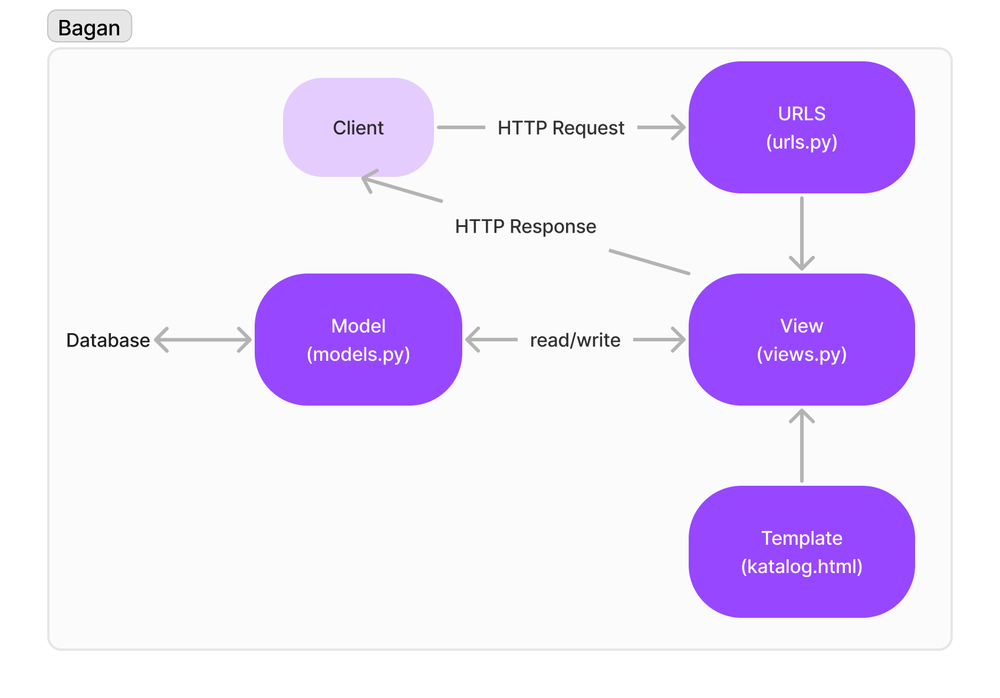

**Link menuju aplikasi Heroku:** https://katalogsalma.herokuapp.com/katalog/

**Buatlah bagan yang berisi request client ke web aplikasi berbasis Django beserta responnya dan jelaskan pada bagan tersebut kaitan antara urls.py, views.py, models.py, dan berkas html**

Model merupakan kumpulan data yang akan digunakan dalam program. File models.py dapat memiliki sebuah class atau lebih sebagai kerangka database. Object dari class tersebut memiliki data-data yang merupakan atribut class. Views yaitu program views.py menerima request dan mengembalikan render response, yaitu template berupa katalog.html. Response dari views berupa file HTML dari template yang bersesuaian dan ditampilkan kepada user.

**Jelaskan kenapa menggunakan virtual environment? Apakah kita tetap dapat membuat aplikasi web berbasis Django tanpa menggunakan virtual environment?**

Virtual environment digunakan agar tidak terjadi konflik antara packages atau library yang telah terinstall pada komputer. Python virtual environment akan mengisolasikan dependencies yang akan digunakan pada aplikasi ini.

Ya, aplikasi web berbasis Django tetap dapat dibuat tanpa menggunakan virtual environment. Namun, tindakan tersebut berpotensi untuk overwrite packages yang ada secara global dengan requirements yang sedang digunakan.

**Jelaskan bagaimana cara kamu mengimplementasikan poin 1 sampai dengan 4 di atas.**
1. Views yakni file views.py terdapat sebuah fungsi `show_katalog(request)` yang menerima argumen berupa request. Fungsi tersebut akan mengambil data dari model class `CatalogItem`. Dictionary berupa `context` menyimpan list_barang, nama, dan npm. Return dari fungsi ini akan me-render `katalog.html` dengan data pada context.
2. `urlpattern` di file urls.py pada folder katalog ditambahkan kode `path('', show_katalog, name='show_katalog')` sebagai routing yang memetakan `/katalog` pada fungsi `show_katalog` di `views.py`.
3. Template `katalog.html` ditambahkan `{{nama}}` dan `{{npm}}` pada bagian "Fill me!". For loop pada `list_barang` digunakan untuk menampilkan data pada tabel katalog.
4. Melakukan add, commit, dan push. App Heroku dibuat dan membuat secrets baru pada repository berupa HEROKU_APP_NAME dan HEROKU_API_KEY dengan value yang sesuai. Aplikasi ter-deploy sebagaimana terlihat dari Github Actions.

**Testing: Mengimplementasikan dan mendemonstrasikan testing dasar**

Test berupa unit testing yang mengecek url. Fungsi test_url() akan melakukan testing terhadap url `/katalog/`.  
Jika url benar dan dapat diakses, response yang akan dikembalikan yaitu status code 200. Pengecekan dilakukan oleh fungsi dari module TestCase yaitu `assertEqual`.

Test dapat dijalankan menggunakan command `python manage.py test` pada terminal.

Referensi: https://docs.djangoproject.com/en/4.1/topics/testing/overview/

