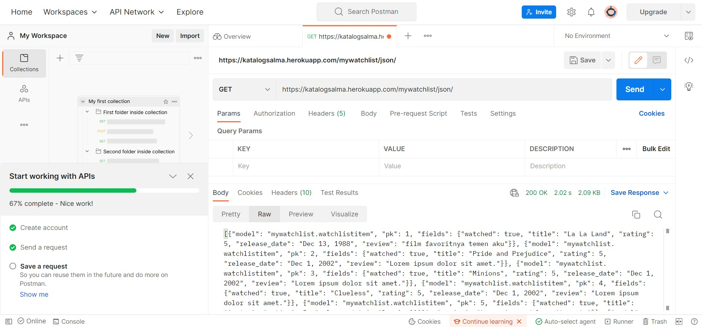
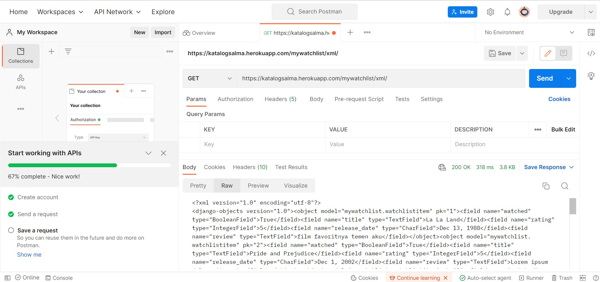

**Link menuju aplikasi Heroku:** https://katalogsalma.herokuapp.com/katalog/

**Jelaskan perbedaan antara JSON, XML, dan HTML!**
JSON, XML, dan HTML merupakan implementasi data delivery.
- HTML dan XML memiliki tags, namun closing tag wajib untuk elemen XML. JSON tidak menggunakan tag untuk membungkus informasi
- HTML menampilkan data dan memberikan struktur pada website, sementara XML dann JSON berfokus pada transfer data.
- XML harus di-parse menggunakan XML parser. Sementara JSON bisa di-parse menggunakan JavaScript.
- HTML dan XML merupakan markup language, sementara JSON merupakan format data.

**Jelaskan mengapa kita memerlukan data delivery dalam pengimplementasian sebuah platform?**
Data delivery berguna untuk memindahkan data ke aplikasi lainnya.

 
**Jelaskan bagaimana cara kamu mengimplementasikan checklist di atas.**
1. Melakukan django startapp untuk aplikasi mywatchlist
2. Melakukan konfigurasi url pada urls.py pada folder project_django
3. Membuat model data pada models.py dengan field title, watched, rating, release_date, dan review
4. Membuat 10 object pada initial_watchlist_data.json dengan model data yang bersesuaian pada models.py kemudian melakukan loaddata.
5. Melakukan implementasi penyajian data menggunakan fungsi-fungsi yang dibuat pada views.py serta membuat file HTML yaitu watchlist.html
6. Melakukan routing dengan menambahkan urlpatterns dengan fungsi yang bersesuaian pada urls.py di folder mywatchlist
7. Add, commit, dan push ke repository github

**Screenshot Postman**

**Testing: Mengimplementasikan dan mendemonstrasikan testing dasar**

Test berupa unit testing yang mengecek url dengan path /mywatchlist/ untuk /html/, /xml/, dan /json/. 
Jika url benar dan dapat diakses, response yang akan dikembalikan yaitu status code 200. Pengecekan dilakukan oleh fungsi dari module TestCase yaitu `assertEqual`.

Test dapat dijalankan menggunakan command `python manage.py test` pada terminal.

Referensi: https://docs.djangoproject.com/en/4.1/topics/testing/overview/

